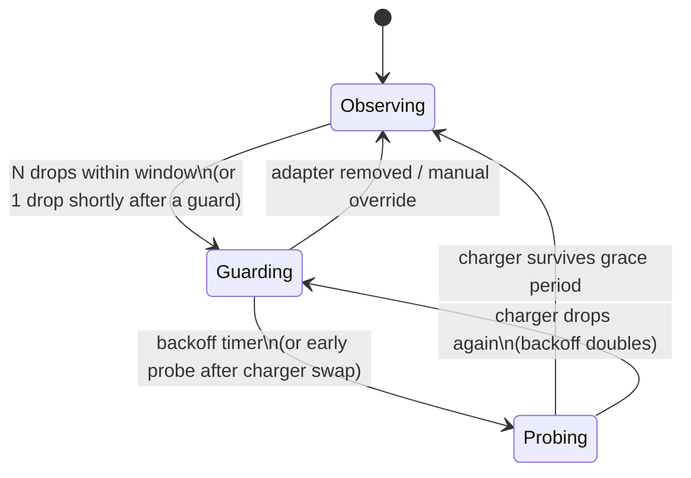

# ⚡🛡 ChargeGuard

[](https://github.com/byrvr/chargeguard/actions/workflows/ci.yml)
[](#requirements)
[](#building)
[](LICENSE)

**Make a flaky USB-C charger usable.** ChargeGuard is a macOS menu bar app
for Apple Silicon Macs that detects when a charger keeps tripping and
reconnecting (the dreaded connect–disconnect loop) and automatically pauses
battery charging so the charger only has to power the Mac — then sneaks
charge back in whenever the charger can take it.

## The problem

Cheap or aging USB-C chargers often advertise more power than they can
sustain (a "65W" charger that browns out at 40W). The Mac negotiates the
full budget, draws it while charging, the charger trips its protection,
drops, recovers, renegotiates — forever. One real-world measurement: **89
reconnects in 33 minutes, gaining 1% battery.**

## Why there is no "just charge at 35W" setting

We went deep so you don't have to:

- Apple Silicon's SMC has **no writable charge-current or wattage key** —
  every charging control is a binary gate or a percentage limit (verified
  against the Asahi Linux `macsmc-power` driver and a full SMC key dump).
- No existing tool (AlDente, batt, Battery Toolkit, bclm) can limit
  charging *rate* — only on/off and percentage caps.
- The USB-C PD contract is negotiated in firmware; macOS always takes the
  highest profile and offers no override.
- The SMC's input-power budget key (`ACPW`) rejects writes with status
  `0x86` (not writable) — tested on real hardware.

The one writable lever on modern Apple Silicon firmware is **`CHTE`**:
inhibit battery charging entirely. With charging inhibited, the adapter
carries only system load (~10–30W) — which even a weak charger can sustain.
ChargeGuard builds a control loop on top of that lever.

There is also an **opt-in experimental path** that goes further — driving the
Type-C controller to renegotiate the PD contract down to a lower advertised
profile so the battery keeps charging at a reduced budget. See
[PD downshift](#experimental-pd-downshift-opt-in) below.

## How it works



- **Observing** — macOS controls charging normally; ChargeGuard just watches.
- **Guarding** — flap detected: charging is inhibited (SMC `CHTE`), AC Low
  Power Mode optionally engaged; the Mac runs steadily off the charger.
- **Probing** — periodically re-enables charging; a good charger passes and
  the guard lifts, a bad one fails and the backoff doubles (up to 1 h).

Real-world result on the charger that motivated this project: from *1% per
half hour amid constant disconnects* to *~10% per half hour, quietly*.

### Safety engineering

- Charging is force-enabled on every helper start and clean shutdown — a
  crash can never leave your battery stuck non-charging.
- The pre-guard Low Power Mode value is persisted to disk before changing
  it and recovered after an unclean exit.
- The desired charging state is re-asserted every cycle while guarding, so
  an external SMC write can't silently defeat the guard.
- All timing uses `CLOCK_UPTIME_RAW`, which pauses during sleep — slept
  time never counts toward probe grace periods (no false "charger is fine"
  verdicts after an overnight lid-close).
- SMC writes are restricted to the single key `CHTE`, with layout
  validation before writing and an authoritative read-back after.

## Experimental: PD downshift (opt-in)

Chargers advertise a menu of PD profiles (this project's test charger offers
15 / 27 / 36 / 45 / 65 W). macOS always negotiates the top one and exposes no
override — so a mis-rated 65 W charger is asked for 65 W it can't hold.

ChargeGuard can drive the Type-C controller (`AppleHPM` → TI CD3217) to
renegotiate **down** to a lower advertised profile, so the battery keeps
charging at a budget the charger can actually sustain — the real fix, versus
merely pausing charging. It is **off by default** and built to be
recoverable, not merely hopeful:

- **Read-only probe first.** Enabling it runs a probe that opens and unlocks
  the controller (the same operations `macvdmtool` performs safely) and
  *reads* the active-contract and sink-policy registers, validating both
  decode as the expected layout. Only then is the write path unlocked; if
  your controller differs it refuses, and you stay on the charge-inhibit
  guard.
- **Volatile only, structurally.** The C bridge can write just two RAM policy
  registers and issue only five whitelisted commands — flash/OTP tasks (the
  only permanent-brick class) are impossible to reach. The worst realistic
  failure is a disrupted port that a reboot clears.
- **Self-verifying + always recoverable.** The original register bytes are
  saved to disk before the first write; every downshift reads the contract
  back and auto-reverts on any anomaly; disengage, shutdown, and a
  crash-recovery pass on the next launch all restore from those saved bytes.
- **Watchdogged.** PD calls run behind a hard deadline off the engine queue,
  so a wedged controller call can never freeze the guard or block shutdown.

Enable it under Settings → *Experimental: lower the charge budget*, and run
**Probe Controller** first. It drives an undocumented controller —
recoverable by design, but use at your own risk.

## Architecture

Two components, the standard privileged-daemon pattern:

| Component | Runs as | Role |
|---|---|---|
| `ChargeGuard.app` | user | SwiftUI menu bar UI: status, activity log, settings |
| `ChargeGuardHelper` | root (LaunchDaemon) | guard engine, SMC access, power-event monitoring |

The app registers the helper via `SMAppService` (one-time approval in
System Settings › Login Items) and talks to it over XPC. Power events come
from IOKit notifications (`IOPSNotificationCreateRunLoopSource`,
`IORegisterForSystemPower`) — no polling of `pmset` output.

## Requirements

- Apple Silicon Mac (M1 or newer) on macOS 14+
- Modern firmware exposing the `CHTE` charge-inhibit key (macOS
  Sequoia/Tahoe era; older firmware uses `CH0B`/`CH0C`, not yet supported)

## Building

```sh
brew install xcodegen
git clone https://github.com/byrvr/chargeguard.git
cd chargeguard
xcodegen            # regenerates ChargeGuard.xcodeproj from project.yml
open ChargeGuard.xcodeproj
```

Build and run the `ChargeGuard` scheme. On first launch click **Install
Helper** and approve it in System Settings › Login Items.

## FAQ

**Will this charge my battery at full speed?**
No — nothing can, on a charger that can't deliver its rating. ChargeGuard
maximizes what the charger *can* give while eliminating the disconnect
storm that stresses the charger, the port, and the battery.

**Does it interfere with good chargers?**
No. The guard only engages on a flap signature (repeated drops in a short
window), and a charger swap triggers a quick probe that lifts the guard
within minutes.

**Is writing SMC keys safe?**
`CHTE` is the same key used by established tools (AlDente-class utilities,
`batt`). ChargeGuard validates the key's type and size before writing,
verifies every write with a read-back, and touches nothing else. SMC state
is volatile — a full shutdown resets everything.

**Why does the helper need root?**
SMC writes require it. The helper is ~600 lines, single-purpose, and easy
to audit.

## Prior art & credits

- [AlDente](https://apphousekitchen.com) — charge-percentage limiting
- [batt](https://github.com/charlie0129/batt) — the CHTE/Tahoe key mapping
- [Battery Toolkit](https://github.com/mhaeuser/Battery-Toolkit) — the
  app + privileged helper architecture
- [Asahi Linux](https://asahilinux.org) — the definitive reverse
  engineering of the Apple Silicon SMC battery interface

## License

[MIT](LICENSE)

## Disclaimer

ChargeGuard manipulates the system's charging gate. It ships with multiple
layers of crash-safety, but you use it at your own risk. A charger that
can't deliver its advertised rating is worth replacing regardless.
